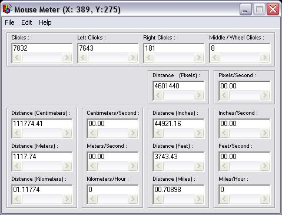



## \[Mouse Meter\]

### Description

This is my mouse meter that I made. I took a little bit of time, but it works great!

plase give me comments and vote thx.

-LCSBSSRHXXX
 
### More Info
 

             |
---                |---
**Submitted On**   |2004-05-31 15:34:14
**By**             |[LCSBSSRHXXX](https://github.com/Planet-Source-Code/PSCIndex/blob/master/ByAuthor/lcsbssrhxxx.md)
**Level**          |Advanced
**User Rating**    |4.4 (22 globes from 5 users)
**Compatibility**  |VB 6\.0
**Category**       |[Miscellaneous](https://github.com/Planet-Source-Code/PSCIndex/blob/master/ByCategory/miscellaneous__1-1.md)
**World**          |[Visual Basic](https://github.com/Planet-Source-Code/PSCIndex/blob/master/ByWorld/visual-basic.md)
**Archive File**   |[\[Mouse\_Met175243612004\.zip](https://github.com/Planet-Source-Code/lcsbssrhxxx-mouse-meter__1-54125/archive/master.zip)

